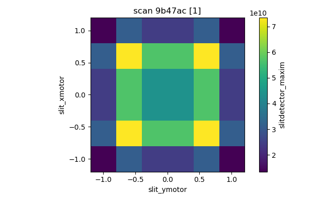
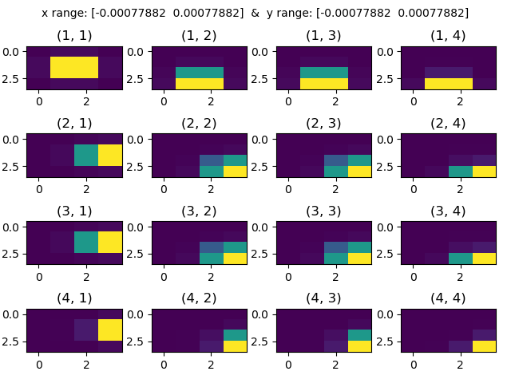

Install sirepo.

SSH to sirepo server
```export SIREPO_SERVER_ENABLE_BLUESKY=1```can also export this to bashrc of vagrant server so its not needed to do this everytime. Then,

Start sirepo server```sirepo service http ```and visit to 10:10:10:10:8000 on the browser if not vagrantfile configured with other address.  And import one of the zip file (use HXD(simplified).zip which has only one slit as I have commented out other components from detector for it to run faster) to simulate on the browser.


The weblink has 8 digit id which is the simulation to be used for simulation.

To run the scan run scan.py file
```
python scan.py -xi -1 -xf 1 -xs 6 -yi -1 -yf 1 -ys 6 -id stciNEX4
```
the center of slit moves from (-1,-1) to (1,1) mm with 6 steps on each axes. id is 8 digit code which is from address in browser

results of simulation will be saved on images folder. 

This image shows maximum intensity at each point of scan.



Image below shows what beam looks like at watchpoint for each points of scan. The coordinate at top of subplots represents the steps in scan


